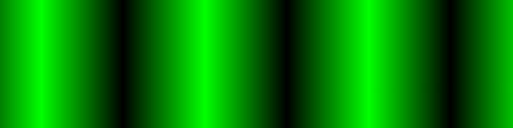

\[click on image to start to the interactive demonstration\]
[](https://xyzzy.github.io/realDPI/)

# realDPI
Visual DPI tester
Finding the physical screen resolution by using moiré patterns

Try the demonstration here: [https://xyzzy.github.io/realDPI/](https://xyzzy.github.io/realDPI/)

## Welcome to the Wonderful broken World of browser DPI.

*when you see things the browser doesn't*

## Real DPI

Visually detect our browsers real screen resolution and DPI.

Browsers have broken the internet. Instead of making available their real resolution and DPI, they spoof the DPI to the self-proclaimed "standard" of 96 dots per inch.

The hack effectively changes your high-resolution and flagship expensive screen to something like 384x854

## Why is this a problem

Browser coordinates used to position page elements are floating point. This scales for any screen size and this spoofing is generally invisible.

The problem arises with procedural generated content, specifically `<canvas>` in combination with `context2d.putImageData()` which is integer based.

To compensate you need to oversample the canvas. MDN suggests [https://developer.mozilla.org/en-US/docs/Web/API/Window/devicePixelRatio](https://developer.mozilla.org/en-US/docs/Web/API/Window/devicePixelRatio) using `window.devicePixelRatio`.
In theory `window.availableWidth/Height` times `window.devicePixelRatio` should be the physical pixel size, only experience reveals this is seldom the case.

## Why this page

Browsers lie, hide and conceal the physical pixel size of your screen.
However, carefully constructing the canvas can produce moiré effects when down sampled.
The patterns give visual hints to determine the actual size.

The CSS standard has sadly botched the meaning of DPI by fixating it to being 96 on any screen on any device.
Browser builders have tried to compensate this by introducing `window.devicePixelRatio`.
Sadly, even that does not always reveal reality.

There is currently no way to get any physical screen measurements or real DPI using javascript.

## Observations

Firefox desktop (4K screen):

- 4K has `availWidth/Height` of 3840x2160 with pixelRatio=1.
- With full screen, `clientHeight` is one less for the historical hidden menu bar/line.
- Resizing with ctrl +/- keeps `clientWidth` and `availWidth` identical.

Chrome desktop (4K screen)

- 4K has `availWidth/Height` of 2560x1440 with `pixelRatio=1.125`.
- Resizing with ctrl +/- keeps `availWidth` constant and changes `clientWidth`/`pixelRatio`.
- `clientWidth/Height` does not match `availWidth/Height`.
- To get a 4K `clientWidth/Height` you need to `ctrl-`. Browser then reports `availWidth/Height` of 2560*1440 and `pixelRatio=1`.

Firefox mobile (1440x2560 screen)

- 1440x2560 has `availWidth/Height` of 360x640 with `pixelRatio=4`.
- `clientWidth/Height` does not match `availWidth/Height`.
- Additionally, portrait has `clientWidth/Height` 980x1524  (that about 68% of available).
- Additionally, landscape has `clientWidth/Height` 980x551  (that about 38% of available).

Chrome mobile (1440x2560 screen)
- 1440x2560 has `availWidth/Height` of 360x640 with `pixelRatio=4`.

## Further reading

[https://www.quirksmode.org/blog/archives/2010/04/a_pixel_is_not.html](https://www.quirksmode.org/blog/archives/2010/04/a_pixel_is_not.html)

[https://daringfireball.net/2010/04/why_960_by_640](https://daringfireball.net/2010/04/why_960_by_640)

[https://fronteers.nl/congres/2012/sessions/a-pixel-is-not-a-pixel-peter-paul-koch](https://fronteers.nl/congres/2012/sessions/a-pixel-is-not-a-pixel-peter-paul-koch)

## Source code

Grab one of the tarballs at [https://github.com/xyzzy/realDPI/releases](https://github.com/xyzzy/realDPI/releases) or checkout the latest code:

```sh
  git clone https://github.com/xyzzy/realDPI.git
```

## Versioning

This project adheres to [Semantic Versioning](http://semver.org/spec/v2.0.0.html).
For the versions available, see the [tags on this repository](https://github.com/xyzzy/realDPI/tags).

## License

This project is licensed under Affero GPLv3 - see the [LICENSE.txt](LICENSE.txt) file for details.
